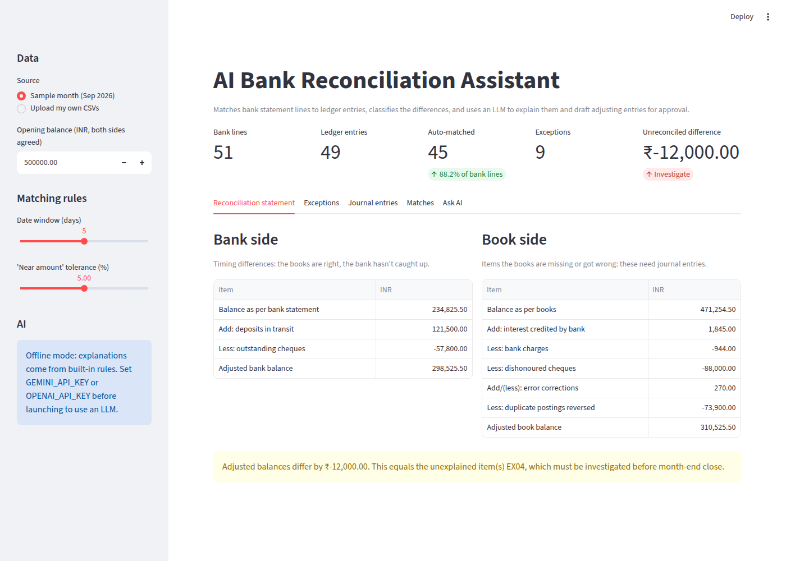

# AI Bank Reconciliation Assistant



Month-end bank reconciliation, the job of proving that the company's cash book agrees with the bank statement, is still largely manual in most finance teams. This tool automates it:

1. **Matches** bank statement lines to general-ledger entries. It runs three SQL passes (exact → date window → near amount), resolved one-to-one in Python with fuzzy description scoring.
2. **Classifies** what's left over with accounting rules: bank charges, interest, dishonoured cheques, outstanding cheques, deposits in transit, duplicates, transposition errors and unexplained items.
3. **Builds the Bank Reconciliation Statement** and proposes balanced adjusting journal entries.
4. **Uses an LLM** (Gemini or OpenAI) to explain each exception in plain English, draft the entry, and answer questions about the reconciliation.
5. **Guards the AI.** Every LLM reply is schema-validated and its amounts are checked against the rule engine. Nothing is posted without human approval.

> **AI proposes, rules verify, humans approve.**

## Quick start

```bash
pip install -r requirements.txt
python data/generate_sample_data.py     # (re)creates the sample CSVs
streamlit run app.py                    # UI at http://localhost:8501
uvicorn api:app --reload                # API, docs at http://127.0.0.1:8000/docs
python -m pytest -q                     # 14 tests
```

It runs fully **offline**, with explanations generated by built-in rules. To use a real LLM, set a key before launching:

```bash
export GEMINI_API_KEY=...        # free key: https://aistudio.google.com/apikey
# or
export OPENAI_API_KEY=...
# optional: GEMINI_MODEL / OPENAI_MODEL to pick a model
```
On Windows PowerShell, use `$env:GEMINI_API_KEY="..."`.

## Project layout

```
recon/
  data.py      load + validate CSVs; money stored as integer paise
  engine.py    SQL candidate matching, one-to-one selection, rule classification
  report.py    Bank Reconciliation Statement + proposed journal entries
  ai.py        LLM explanations, grounded Q&A, schema + amount guardrails
app.py         Streamlit UI (reconciliation, exceptions, approvals, chat)
api.py         FastAPI REST endpoints
data/          sample-data generator + September 2026 sample files
tests/         pytest suite (engine, BRS math, AI guardrails with a fake LLM, API)
```

## Sample results (September 2026, fictional company)

| | |
|---|---|
| Bank lines / ledger entries | 51 / 49 |
| Auto-matched | 45 pairs (88% of bank lines) |
| Exceptions found | 9 (all planted exception types detected) |
| Journal entries proposed | 6 |
| Unreconciled difference | ₹12,000, exactly the one unexplained bank debit (EX04), shown rather than hidden |

## Input format

| Bank statement | General ledger |
|---|---|
| `txn_id, date, description, reference, amount` | `entry_id, date, description, reference, amount, account` |

`amount` is signed from the company's point of view: + for money in, − for money out.

## Limitations and next steps

- It does one-to-one matching only. Many-to-one matching, such as one bank deposit covering three invoices, is the natural next step (a subset-sum problem).
- The classification rules are keyword-based and tuned to Indian bank narrations. A real deployment would learn them from past reconciliations.
- Approvals live in the browser session. Production use would need a database and an audit log.
